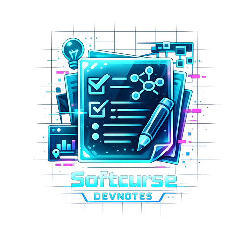

# DevNotes Desktop

A streamlined, robust desktop experience for managing your DEVnotes projects.

## Architecture & Installation
This project utilizes Tauri + Vite + React, packaged with a deeply-integrated **Inno Setup** script.

For comprehensive instructions on how to build, package, and generate identical Windows icons using our custom Publishing architecture, please see [INSTALLER.md](./INSTALLER.md).

## Requirements
Please see [requirements.txt](./requirements.txt) for system prerequisites before building.
